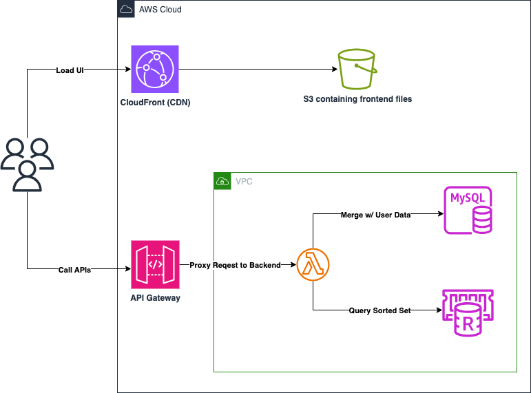

# Build a Real-Time Gaming Leaderboard with Amazon ElastiCache for Redis
This repository contains the code sample on how to build a gaming leaderboard using Amazon ElastiCache for Redis. More details about the architecture can be found in the [blog](https://aws.amazon.com/blogs/database/building-a-real-time-gaming-leaderboard-with-amazon-elasticache-for-redis/).

## High Level Architecture
This is a simple demo demonstrating how developers can take advantage of Sorted Sets to build a gaming leaderboard. The following is a high-level diagram of the sample application.

## Requirements
To deploy the demo application, you need the following:
- We store database and Redis snapshots in the `snapshots` folder, so to clone the repository you need to [install Git LFS](https://docs.github.com/en/repositories/working-with-files/managing-large-files/installing-git-large-file-storage).
- Clone the repository using the following command: `git lfs clone https://github.com/aws-samples/build-real-time-leaderboard-redis`
- Node (v18 and higher) and the corresponding NPM.
- [Cloud Development Kit (CDK) v2](https://docs.aws.amazon.com/cdk/v2/guide/getting_started.html#getting_started_install)

## Bootstrapping
If you haven't used CDK or haven't deployed anything using CDK, you need to [bootstrap your account/region](https://docs.aws.amazon.com/cdk/v2/guide/bootstrapping.html). To do that, run the following command:

`cdk bootstrap aws://{ACCOUNT-NUMBER}/{REGION}`

## Deployment
Once your account/region has been bootstrapped. You can now deploy the demo application by running the following command:

`cdk deploy`

## Deployment Outputs
Once the deployment is done, you will see 2 outputs in your terminal, these are as follows:

- `ElasticacheGamingLeaderboardStack.APIGatewayInvokeURL`: the API Gateway endpoint if you want to test the APIs. The frontend interacts with this particular endpoint to load the leaderboard or upsert scores to the leaderboard.
- `ElasticacheGamingLeaderboardStack.FrontendURL`: You can take this URL and open in your browser. This contains a basic UI to see what's in the leaderboard. You can also use your browser's developer tools to observe the API interactions and its payload.